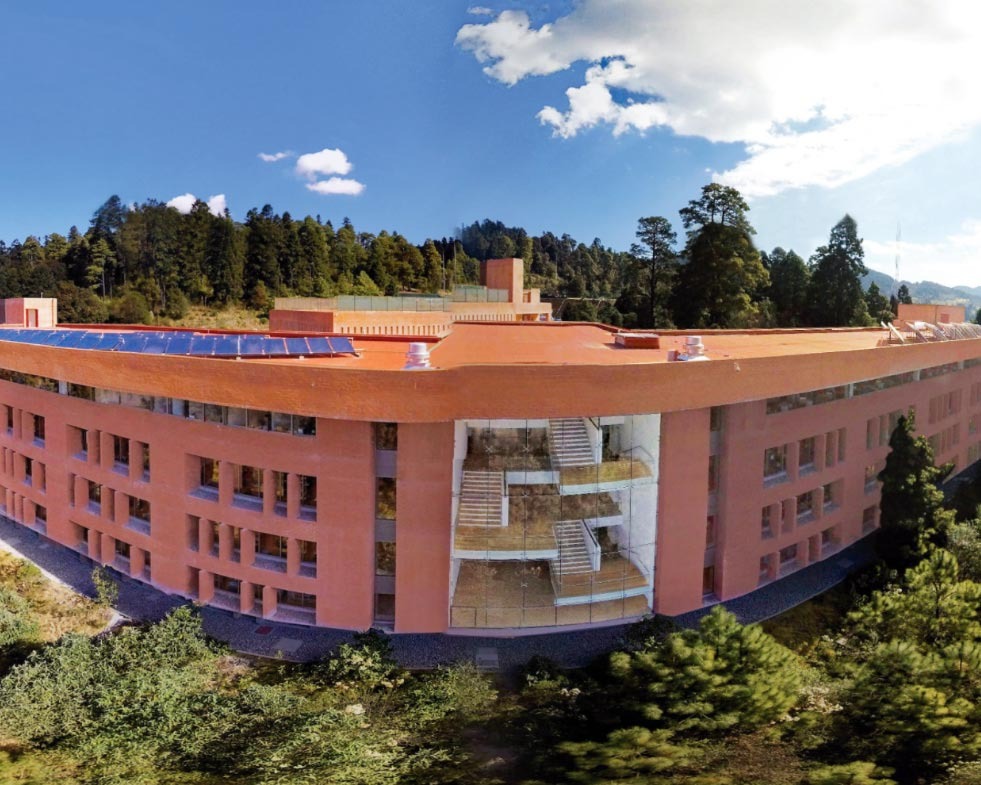

# Portal Familias Prepa Ibero

## Desarrollado por Nicolas Amaya

Live demo : [https://portalfamilia-nicolas-amaya.onrender.com/](https://portalfamilia-nicolas-amaya.onrender.com/)

### Herramientas

Desarrollado en su totalidad con el uso reactjs. Se utilizo react-router y pdf-viewer.

### Paginas

**Home:** Donde se pueden encontrar los enlacs a todas las paginas. Tambien hay un visualizador de pdf en donde se puede var el calendario anual. Existe tambien un slider para encontrar la información del usuario y poder cambiar esta misma.

**Reglamento:** Visualizador de pdf interactivo para una facil lectura del mismo.

**Hoario:** Creado de tal forma que pueda actualizarse con el simple cambio del archivo json del cual se este basando en ese momento.

**Calificaciones:** Estan separadas las rutas de las calificaciones por semestre para poder ser compatidas y tambien para poder buscar de forma más granular estas fismas en los servidores.

**Login:** Se puede encontrar en home en la parte de salir sesion (realmente no te sales de ninguna sesion simplemente es para ver el log in). Despues de dar click en entrar se puede ver la pagina 404.

**Mucho más...**

### Comandos

Instala las dependencias

```sh
npm i ## Instaling Packages
```

```sh
bun i
```

Correr el programa

> [!WARNING]
> Este Programa nesesita alguna forma de ejcucion de JavaScript ( node, bun, deno)

```sh
npm run dev
```

o

```sh
bun run dev
```

### Sobre el Autor

Mi nombre es Nicolas Amaya y soy un desarrollador junior donde este es uno de mis primeros trabajos con el uso exclusivo de react. Estoy abierto de cuaquier comentario o mejora posible. Si te gusta hasmelo saber con una estrella.

Pueden saber más de mi en este enlace [https://nicolas-amaya.onrender.com/](https://nicolas-amaya.onrender.com/)

